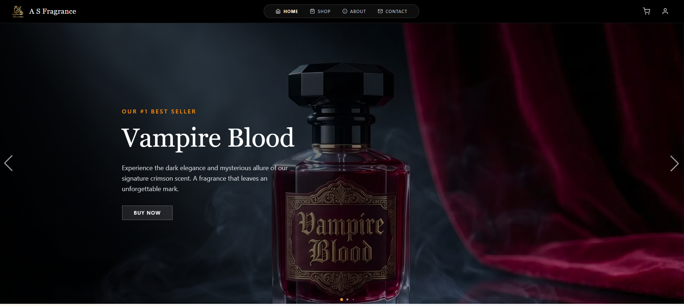
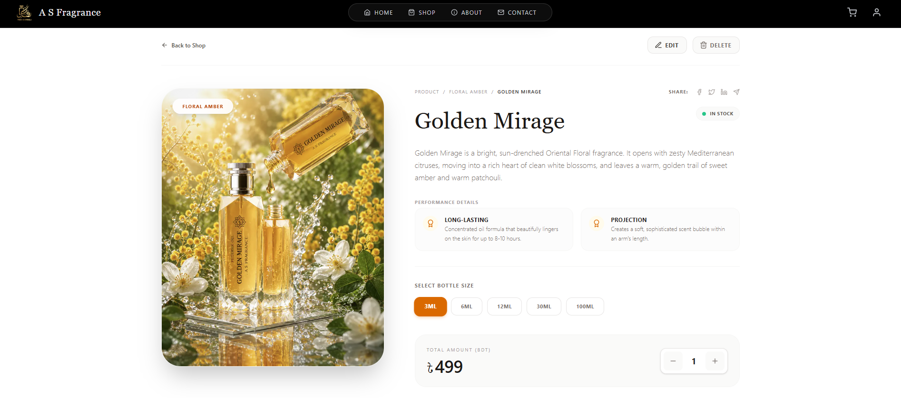
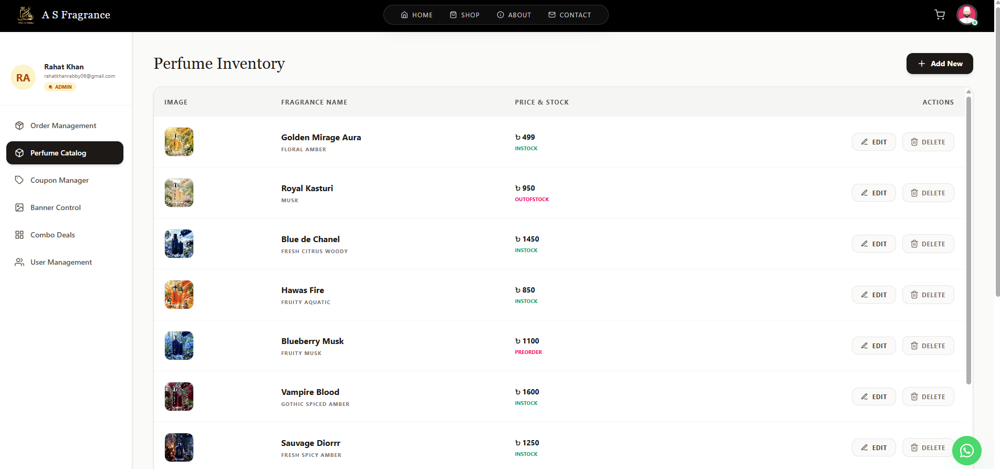

# 🌟 A S Fragrance | Premium E-Commerce Platform

Welcome to the repository for **A S Fragrance**, a modern, high-performance, and visually captivating e-commerce platform dedicated to luxury perfumes. Built with the latest web technologies, this project perfectly balances an elegant user experience with a powerful, secure, and intuitive admin management system.

---

## 🎨 The "Vibe Coding" Philosophy
This project isn't just about making things work; it's about making them *feel* right. The architecture and design philosophy revolve around **"Vibe Coding"**:
*   **Minimalist & Luxurious:** A dark/light contrast theme using Tailwind CSS v4, accented with premium amber and gold tones that reflect the essence of luxury fragrances.
*   **Component-Driven Precision:** Built with Next.js 16 and React 19, leveraging a highly modular structure with HeroUI and DaisyUI. Custom styles are meticulously preserved to maintain the brand's unique identity across all breakpoints.
*   **Instant State Management:** Utilizing `zustand` to ensure the shopping cart, UI states, and user sessions feel instant and responsive without heavy re-renders.

---

## ✨ Key Features

### 🛍️ User-Friendly Customer Experience
*   **Seamless Authentication:** Powered by `better-auth`, supporting secure Email/Password and Google OAuth login flows with beautiful glassmorphic dropdown profiles.
*   **Dynamic Shopping Experience:** Real-time cart updates, combo deals, and category-based perfume filtering.
*   **Responsive & Accessible:** Fully responsive design from mobile devices to large desktop monitors, ensuring a premium feel on any screen.
*   **Newsletter & WhatsApp Integration:** Direct communication channels via a custom newsletter API and floating WhatsApp widget for instant customer support.

### 🛡️ Admin-Friendly Management Dashboard
The admin panel is built to be a mission control center that requires zero technical knowledge to operate, making it incredibly admin-friendly:
*   **Role-Based Access Control:** Secure routes ensuring only authorized personnel can access business-critical data.
*   **Perfume Catalog Manager:** Easily Add, Edit, Delete, and track the stock status (e.g., In Stock, Preorder, Out of Stock) of fragrances with a clean table interface.
*   **Order Management:** Track and update customer orders, delivery statuses, and financial calculations seamlessly.
*   **Marketing Controls:** Dedicated sections for *Coupon Manager*, *Banner Control*, and *Combo Deals* to run dynamic promotional campaigns.
*   **User Management:** Oversee registered users, assign roles, and manage the customer base.

---

## 🛠️ Tech Stack

**Frontend & Framework:**
*   **Next.js (v16.2.6)** - React Framework (App Router & Turbopack)
*   **React (v19.2.4)** - UI Library
*   **Tailwind CSS (v4)** - Utility-first styling engine

**UI & Animations:**
*   **HeroUI & DaisyUI** - Modern, accessible component libraries
*   **Framer Motion** - Production-ready animations
*   **Swiper** - Touch-slider integration

**State Management & Auth:**
*   **Zustand** - Lightweight, fast state management
*   **Better-Auth** - Comprehensive authentication solution

**Backend & Database Services:**
*   **MongoDB (v7.2.0)** - NoSQL Database for scalable data storage
*   **EmailJS** - Client-side email triggering for automated responses

---

## 📡 API Endpoints

Below is a reference table for the primary REST API endpoints utilized in this architecture to manage the storefront and admin operations.

| Endpoint | Method | Description | Access Level |
| :--- | :---: | :--- | :--- |
| **Authentication & Users** | | | |
| `/api/auth/*` | `POST/GET` | Handles `better-auth` operations (Login, Signup, OAuth, Session) | Public / User |
| `/api/check-role` | `GET` | Validates the current user's role (Admin/User) | Authenticated |
| `/users` | `GET` | Fetches a list of all registered users | Admin |
| `/users/role` | `PATCH` | Updates a user's role (Admin/User) | Admin |
| `/users/:id` | `DELETE` | Removes a user from the system | Admin |
| `/user-role` | `GET` | Internal API to verify user role securely | Internal |
| **Perfumes Catalog** | | | |
| `/perfume` | `GET` | Fetches the list of all available perfumes (supports `?search=`) | Public |
| `/perfume/:id` | `GET` | Fetches details of a specific perfume | Public |
| `/perfume` | `POST` | Creates a new perfume entry in the database | Admin |
| `/perfume/:id` | `PATCH` | Updates existing perfume details (Price, Stock, Notes) | Admin |
| `/perfume/:id` | `DELETE` | Removes a perfume from the catalog | Admin |
| **Orders & Transactions** | | | |
| `/orders` | `POST` | Submits a new customer order & triggers confirmation emails | Public/Auth |
| `/orders` | `GET` | Retrieves order history (User-specific via `?email=` or All) | User / Admin |
| `/orders/sync` | `POST` | Syncs guest orders to a newly created user account | Authenticated |
| `/orders/:id/status`| `PATCH` | Updates the delivery status of an order | Admin |
| `/orders/:id/payment`| `PATCH` | Updates the payment status of an order | Admin |
| `/orders/:id` | `DELETE` | Deletes an order from the database | Admin |
| **Banners & Marketing** | | | |
| `/banners` | `GET` | Fetches homepage banners sorted by order | Public |
| `/banners` | `POST` | Adds a new promotional banner | Admin |
| `/banners/:id` | `PATCH` | Updates an existing banner | Admin |
| `/banners/:id` | `DELETE` | Deletes a banner | Admin |
| **Combo Deals** | | | |
| `/combos` | `GET` | Fetches all active combo deals | Public |
| `/combos/:id` | `GET` | Fetches details of a specific combo | Public |
| `/combos` | `POST` | Creates a new combo deal | Admin |
| `/combos/:id` | `PATCH` | Updates an existing combo deal | Admin |
| `/combos/:id` | `DELETE` | Deletes a combo deal | Admin |
| **Coupons & Discounts**| | | |
| `/coupons` | `POST` | Creates a new discount coupon | Admin |
| `/verify-coupon` | `POST` | Validates a coupon code during checkout | Public |
| `/coupons` | `GET` | Fetches all active coupons | Admin |
| `/coupons/:id` | `DELETE` | Deletes a coupon code | Admin |
| **Reviews & Feedback** | | | |
| `/reviews/:perfumeId`| `GET` | Fetches all reviews for a specific perfume | Public |
| `/reviews` | `POST` | Posts a new customer review | Authenticated |
| `/reviews` | `GET` | Fetches the 10 most recent reviews for the homepage | Public |
| **Newsletter** | | | |
| `/newsletter` | `POST` | Subscribes a user's email to the marketing newsletter | Public |

---